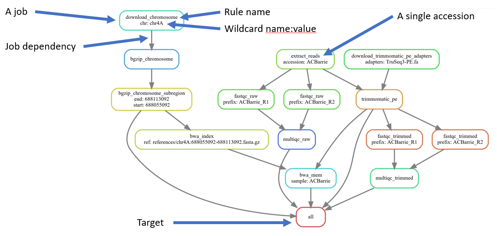
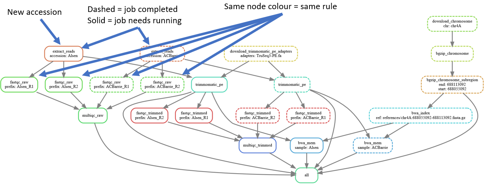
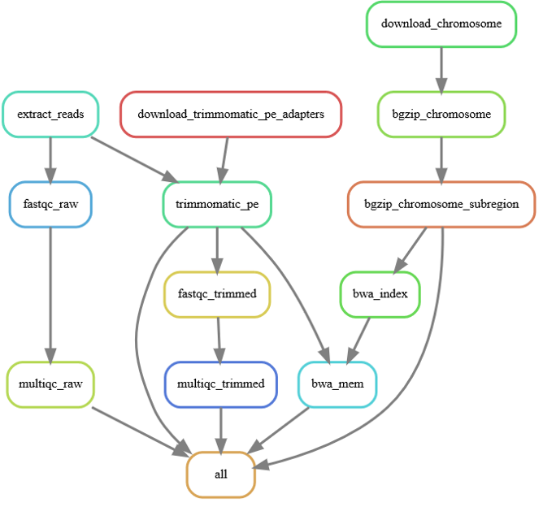

For the purpose of the webinar we will be working on the head node of an HPC cluster running Slurm. This is the most likely infrastructure that fellow bioinformaticians already find themselves using on a regular basis.

The execution of the Snakemake workflow will actually take place on the cluster head node with jobs being submitted to Slurm for queing and processing. From the head node, Snakemake will monitor the submitted jobs for their completion status and submit new jobs as dependent jobs complete sucessfully.

# Snakemake Installation

See also: https://snakemake.readthedocs.io/en/stable/getting_started/installation.html

The recommended installation route for Snakemake is through a conda environemnt. As such, you need Anaconda3, usually avaiable to you on your cluster via the module system.

```bash
# Load the Anaconda3 module on your cluster
# If it's unavailable contact the cluster sysadmin
module load \
  Anaconda3

# Create a new conda environment for snakemake v5.4.0 (currently the latest version)
# https://anaconda.org/search?q=snakemake
conda create \
  --name snakemake \
  --channel bioconda --channel conda-forge \
  --yes \
  snakemake=5.4.0
```

# Snakemake Usage

First, load the conda environment you set up:

```bash
# Load the Anaconda3 module on your cluster
# If it's unavailable contact the cluster sysadmin
module load \
  Anaconda3

# activate the conda environment you created above
source activate snakemake
```

# Example Workflow

```bash
# Clone this repo
git clone https://github.com/UofABioinformaticsHub/2019_EMBL-ABR_Snakemake_webinar

cd 2019_EMBL-ABR_Snakemake_webinar/snakemake-tutorial
```

Now you are ready to run Snakemake. Lets visalise the DAG of job dependencies:

```bash
snakemake \
  --dag \
  | dot -Tsvg \
  > dag.svg
```



See what rules and commands would be executed for a couple of differet targets:

```bash
# The "setup_data" target can be used to create a small reference and read data sets for testing purposes
snakemake \
  setup_data \
  --dryrun --printshellcmds

# Run the whole pipeline (target "all"), which would also generate the test data set
snakemake \
  --dryrun --printshellcmds
```

Provided in this repo is a slurm profile, cluster config files and a conda environment file. This allows Snakemake to interact with Slurm and have the relevant software available to each rule.

Running the pipeline, for real, can be accomplished using:

```bash
# Load Singularity if planning to specify --use-singularity
module load \
  Singularity

snakemake \
  --profile profiles/slurm \
  --cluster-config cluster-configs/default.yaml \
  --cluster-config cluster-configs/phoenix.yaml \
  --use-singularity --use-conda
```

Add a new accession and take a look at the DAG of job dependencies

```bash
# Uncomment the "Alsen" line
sed -i 's/^#  "(Alsen)",/  "\1",/' Snakefile

# Generate DAG of job dependencies
snakemake \
  --dag \
  | dot -Tsvg \
  > dag2.svg
```



Add in the remaining accessions:

```bash
# Uncomment all the accessions
sed -i -r 's/^#  "(.+)",/  "\1",/' Snakefile

# Generate DAG of job dependencies
snakemake \
  --dag \
  | dot -Tsvg \
  > dag3.svg
```


Wow, that's a big/messy DAG of jobs. Lets look at the simpler DAG of rules:

```bash
snakemake \
  --rulegraph \
  | dot -Tsvg \
  > rulegraph.svg
```



Lets just have a look at a count of jobs that would be executed:

```bash
# Get a count of all jobs that would be run
snakemake \
  --dryrun \
  --quiet
```

Run all the new jobs:

```bash
snakemake \
  --profile profiles/slurm \
  --cluster-config cluster-configs/default.yaml \
  --cluster-config cluster-configs/phoenix.yaml \
  --use-singularity --use-conda
```

# Advanced Features

## Static Rule Resources

The provided Slurm profile [profiles/slurm](profiles/slurm) and cluster config files [cluster-configs/default.yaml](cluster-configs/default.yaml) and
[cluster-configs/phoenix.yaml](cluster-configs/phoenix.yaml) provide a means to specify the cluster resources required for each job submitted to Slurm.
The [cluster-configs/default.yaml](cluster-configs/default.yaml) file contains the default values for all jobs and can be used for job-specific values.
[cluster-configs/phoenix.yaml](cluster-configs/phoenix.yaml) provides some override values for things specific to my own Slurm cluster; namely Slurm
`account` and `partition` settings.

Rather than hard-coding resource values directly in these files, one can use `{resources.<some_name>}` and Snakemake will substitute in the value supplied
via the `resources` keyword in the corresponding Snakefile rule. Like so:

```
rule bwa_mem :
	input:     ...
	output:    ...
	resources:
		mem_mb = 10000,
		time_mins = 60,
	shell:     ...
```

The values for these resources must be integers.

## Dynamic Rule Resources

While static rule resources are convienient, what happens to the rule resource requirements if you have higher coverage data or want to use the workflow on
a much larger (or smaller) species or project? Will the rules still have sufficient resources or will they be vastly over specified?

A solution is to have the resources dynamically scale according to the input file sizes. This is possible by using Python `lambda` (annonymous) functions.
In Snakemake these these are called with at least `wildcards` and optionally `input`, `threads` and `attempt`. By default, the supplied `profile` sets
`restart-times` to `2` (see [profiles/slurm/config.yaml](profiles/slurm/config.yaml)) which asks Snakemake to retry failed jobs twice. By using the `attempt`
count and a `lambda` function, we can scale the resources for each retry:

```
rule bwa_mem :
	input:     ...
	output:    ...
	resources:
		mem_mb = lambda wildcards, attempt: 10000 * attempt,
		time_mins = lambda wildcards, attempt: 60 * attempt,
	shell:     ...
```

Perhaps this is too much of a "brute-force" approach and you would prefer a more subtle scaling, sam increase by 10% per retry:

```
rule bwa_mem :
	input:     ...
	output:    ...
	resources:
		mem_mb = lambda wildcards, attempt: math.ceil(10000 * (1+(attempt-1)/10)),
		time_mins = lambda wildcards, attempt: math.ceil(60 * (1+(attempt-1)/10)),
	shell:     ...
```

This approach still doesn't help with scaling accroding to input size, so here's how that might be achived:

```
import os

rule myrule :
	input: index = ...,    
		...
	output:    ...
	resources:
		mem_mb = lambda wildcards, input, attempt: math.ceil( sum(os.path.getsize(f) for f in input['index'] if os.path.isfile(f)) / 1024**2*(1+(attempt-1)/10)),
	shell:     ...
```

If you decide to go this way, you will need to test and benchmark your pipeline against a varied set of input sizes so you can get the resource scaling right for each job.

## Benchmarking Rules

Snakemake provides a means to benchmark runs using the `benchmark` keyword in rules to specify the name of the file into which benchmark information is stored. Together
with the `repeat()` function, the bencmarking of a rule can be repeated multiple times:

```
N_BENCHMARKS = 3

rule bwa_mem :
	input:     ...
	output:    ...
	benchmark:
		repeat("benchmarks/bwa_mem/{prefix}.txt", N_BENCHMARKS),
	shell:     ...
```

# Cleanup the Enviroment

Once we have finished, we will deactive the conda environment:

```bash
source deactivate
``` 
